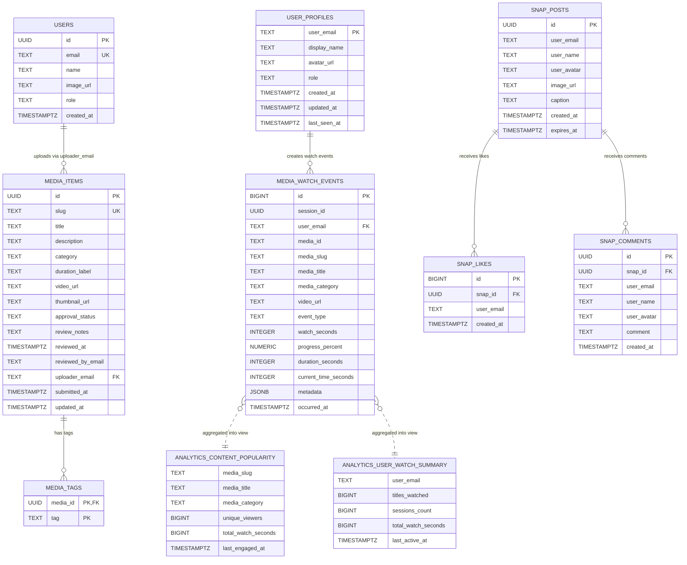

# BITStream ER Diagram

This document captures the current relational structure defined in:

- `/database/schema.sql`
- `/database/supabase/analytics-schema.sql`
- `/database/supabase/snap-schema.sql`

It covers:

- Core BITStream media/moderation tables
- Supabase analytics tables and views
- Supabase Snap feature tables

## Detailed ER Diagram

## Relationship Notes

### 1. Core BITStream content model

- `users.email -> media_items.uploader_email`
  Each media item is uploaded by exactly one application user.
- `media_items.id -> media_tags.media_id`
  Each media item can have many tags.

### 2. Analytics model

- `user_profiles.user_email -> media_watch_events.user_email`
  Each watch event belongs to one tracked user profile.
- `analytics_content_popularity`
  This is a view derived from `media_watch_events`, grouped by `media_slug`.
- `analytics_user_watch_summary`
  This is a view derived from `media_watch_events`, grouped by `user_email`.

### 3. Snap model

- `snap_posts.id -> snap_likes.snap_id`
  One snap can have many likes.
- `snap_posts.id -> snap_comments.snap_id`
  One snap can have many comments.

## Important Design Detail

Some relations are **logical** rather than enforced by a database foreign key:

- `media_watch_events.media_slug` refers to app content identified in the content library / media repository, but it is stored as text rather than as a strict FK to `media_items.slug`.
- `snap_posts.user_email`, `snap_likes.user_email`, and `snap_comments.user_email` are stored as text and represent BITS users, but they are not currently enforced as foreign keys to `user_profiles` or `users`.

This means the schema mixes:

- **strict relational links** where cascading or consistency matters most
- **application-level links** where the app controls consistency through code

## Table Groups

### Core app schema

- `users`
- `media_items`
- `media_tags`

### Supabase analytics schema

- `user_profiles`
- `media_watch_events`
- `analytics_content_popularity` (view)
- `analytics_user_watch_summary` (view)

### Supabase Snap schema

- `snap_posts`
- `snap_likes`
- `snap_comments`
